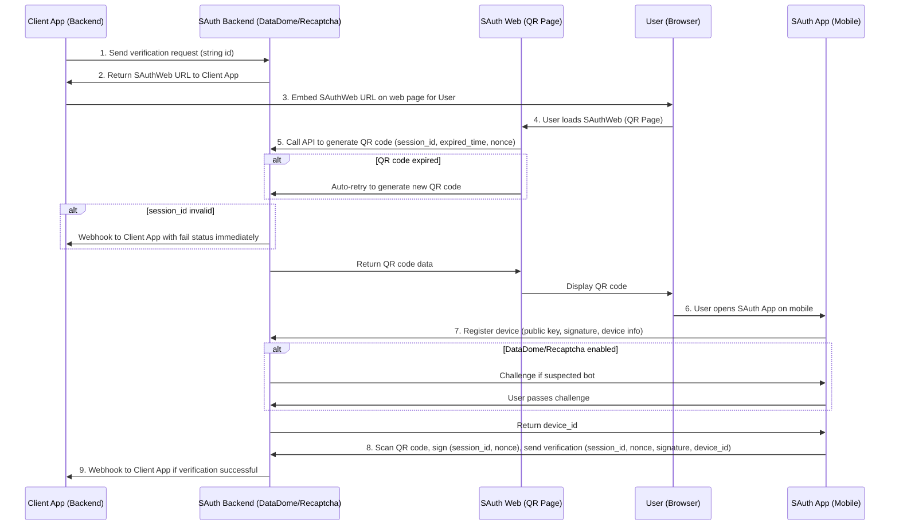
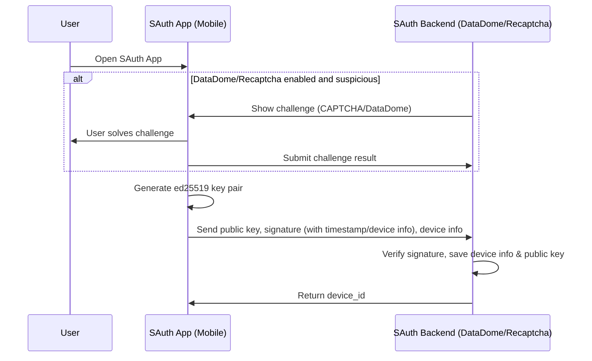

# Overview

## Components

- **SAuth Backend**: The core authentication server, responsible for managing sessions, device registration, verification logic, and integration with security services (e.g., DataDome, Recaptcha).
- **SAuth QRCode**: The web interface that generates and displays QR codes for user authentication. It interacts with the backend to create session-specific QR codes and handles user actions on the web.
- **SAuth Mobile**: The mobile application used by end-users to scan QR codes, register devices, and perform secure authentication. It implements cryptographic operations and communicates securely with the backend. SAuth Mobile can also be built as a dedicated SDK for each client, making integration seamless and customizable.

## Client Registration

Each client registers with the SAuth Backend and receives a unique ClientID, ClientSecret, and an API key for webhook integration. These credentials are used to securely authenticate and manage communication between the client and backend, as well as to receive verification results via webhook.

# Authenticate request

---

## Note

Verification (Step 8) can also be protected by a special data encryption layer, similar to device registration. Without knowledge of this encryption algorithm, performing verification becomes extremely difficult, ensuring only authorized parties can complete the process.

# Register device

## Note

Device registration is secured by an encryption algorithm that is protected within both the mobile app and backend. Without knowledge of this encryption algorithm, device registration cannot be performed, ensuring only trusted devices can join the system.
