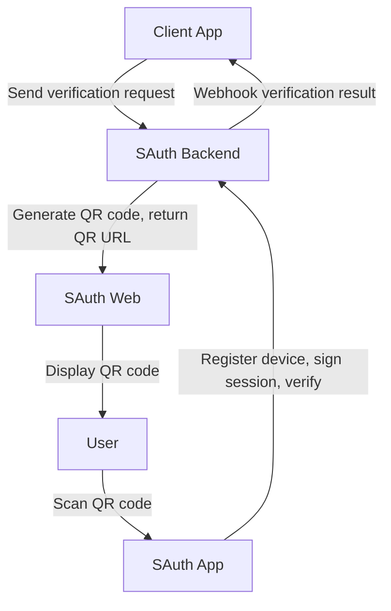
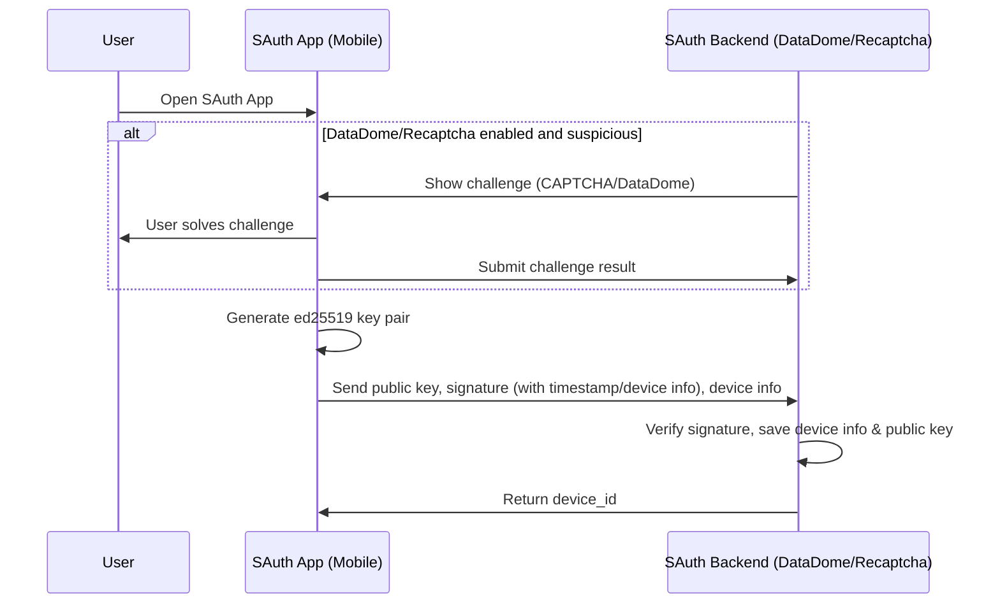
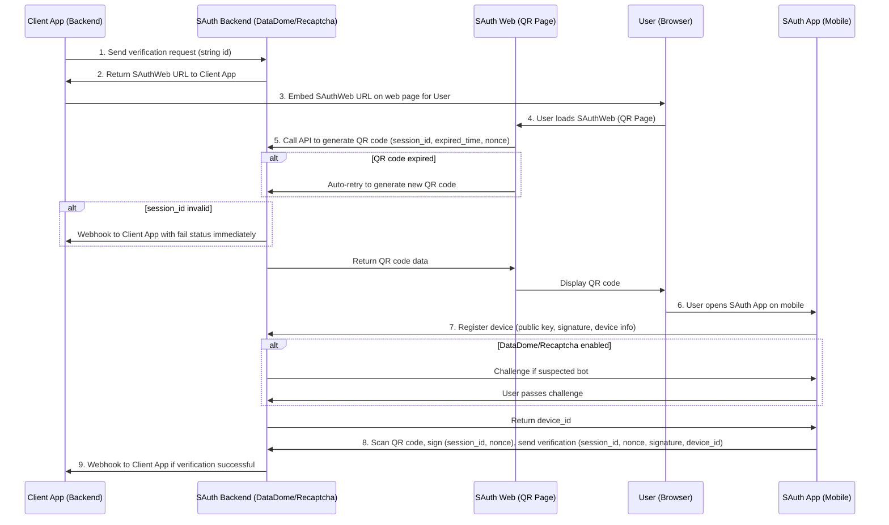

# Overview

```mermaid
flowchart TD
A[Client App] -->|Send verification request| B[SAuth Backend]
B -->|Generate QR code, return QR URL| C[SAuth Web ]
C -->|Display QR code| D[User ]
D -->|Scan QR code| E[SAuth App ]
E -->|Register device, sign session, verify| B
B -->|Webhook verification result| A
```

# Register device

```mermaid
sequenceDiagram
    participant User as User
    participant SAuthApp as SAuth App (Mobile)
    participant SAuthBackend as SAuth Backend (DataDome/Recaptcha)

    User->>SAuthApp: Open SAuth App
    alt DataDome/Recaptcha enabled and suspicious
        SAuthBackend->>SAuthApp: Show challenge (CAPTCHA/DataDome)
        SAuthApp->>User: User solves challenge
        SAuthApp->>SAuthBackend: Submit challenge result
    end
    SAuthApp->>SAuthApp: Generate ed25519 key pair
    SAuthApp->>SAuthBackend: Send public key, signature (with timestamp/device info), device info
    SAuthBackend->>SAuthBackend: Verify signature, save device info & public key
    SAuthBackend->>SAuthApp: Return device_id
```

# Authenticate request

```mermaid
sequenceDiagram
    participant ClientApp as Client App (Backend)
    participant SAuthBackend as SAuth Backend (DataDome/Recaptcha)
    participant SAuthWeb as SAuth Web (QR Page)
    participant User as User (Browser)
    participant SAuthApp as SAuth App (Mobile)

    ClientApp->>SAuthBackend: 1. Send verification request (string id)
    SAuthBackend->>ClientApp: 2. Return SAuthWeb URL to Client App
    ClientApp->>User: 3. Embed SAuthWeb URL on web page for User
    User->>SAuthWeb: 4. User loads SAuthWeb (QR Page)
    SAuthWeb->>SAuthBackend: 5. Call API to generate QR code (session_id, expired_time, nonce)
    alt QR code expired
        SAuthWeb->>SAuthBackend: Auto-retry to generate new QR code
    end
    alt session_id invalid
        SAuthBackend->>ClientApp: Webhook to Client App with fail status immediately
    end
    SAuthBackend->>SAuthWeb: Return QR code data
    SAuthWeb->>User: Display QR code
    User->>SAuthApp: 6. User opens SAuth App on mobile

    SAuthApp->>SAuthBackend: 7. Register device (public key, signature, device info)
    alt DataDome/Recaptcha enabled
        SAuthBackend->>SAuthApp: Challenge if suspected bot
        SAuthApp->>SAuthBackend: User passes challenge
    end
    SAuthBackend->>SAuthApp: Return device_id

    SAuthApp->>SAuthBackend: 8. Scan QR code, sign (session_id, nonce), send verification (session_id, nonce, signature, device_id)
    SAuthBackend->>ClientApp: 9. Webhook to Client App if verification successful
```
