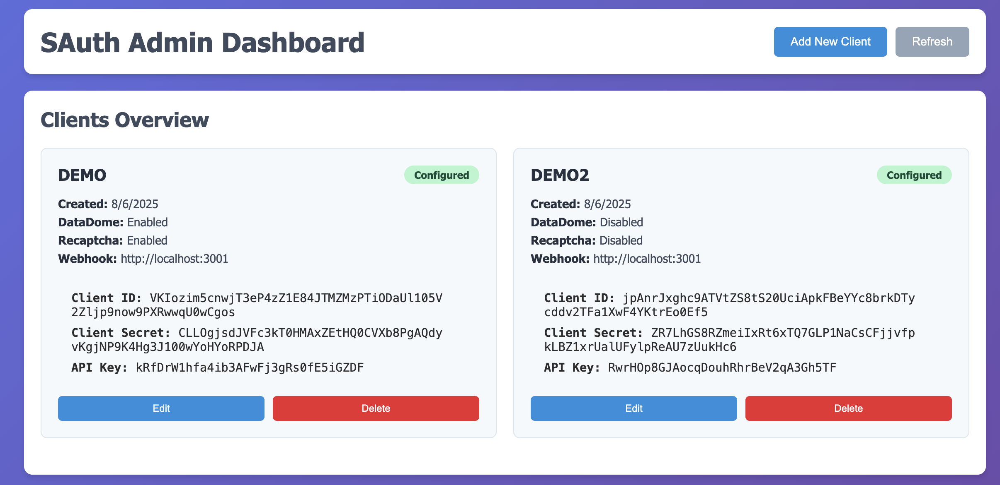

# SAuth - Secure Authentication Solution with QR Code and Mobile App

SAuth is a secure and convenient authentication solution using QR codes and a mobile app. For example, it can be used to verify users when they register to buy lottery tickets to access a football match, ensuring only authorized participants can join these activities.

# Architecture Overview

For a detailed architecture and flow, please see [OVERVIEW.md](OVERVIEW.md).

# Demo

The following sections (1, 2, 3, 4) illustrate a demo flow of the SAuth solution, including the main tools and user experience.

## 1. Server Admin Tool (Client Configuration & Settings)

This section demonstrates how to configure and set up a specific client using the server admin tool, including authentication parameters, webhook API key for verification results, and other settings.

[Demo Link](http://35.165.147.18:3000)

## 2. Client Configuration

Clients can configure authentication parameters, QR code expiration time, webhook for verification results, and more.

[Demo Link](http://35.165.147.18:3001/admin)

## 3. Web Authentication Interface

This is an example of a client who wants to participate in a lucky draw to buy football match tickets. The user is redirected to the authentication web page below:

[Demo Link](http://35.165.147.18:3001)

The user must click "Continue" to start the verification process. When they do, the system will display a QR code in step 4, managed by SAuth.

## 4. QR Code Authentication Flow

After the customer continues, the system displays a QR code. This code is automatically refreshed and expires according to the client configuration.

The user opens the SAuth mobile app, scans the QR code, and completes the authentication process.

---

SAuth enhances security, reduces fraud risks, and improves user experience.

---

By simply improving the device registration process for each client, we can easily build a dedicated mobile SDK for them to integrate and use.
