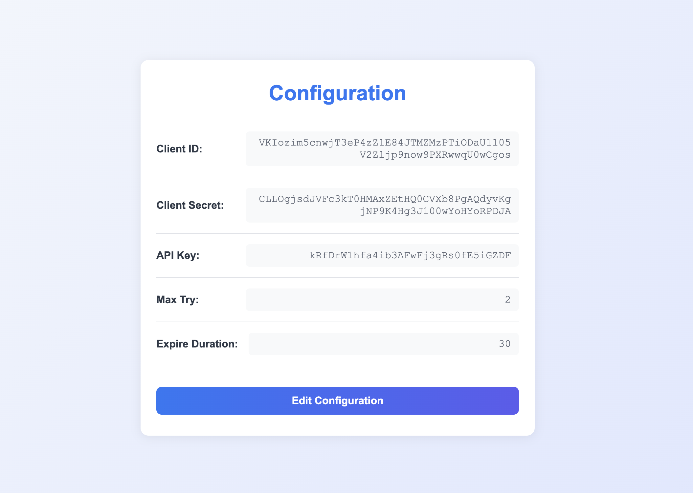
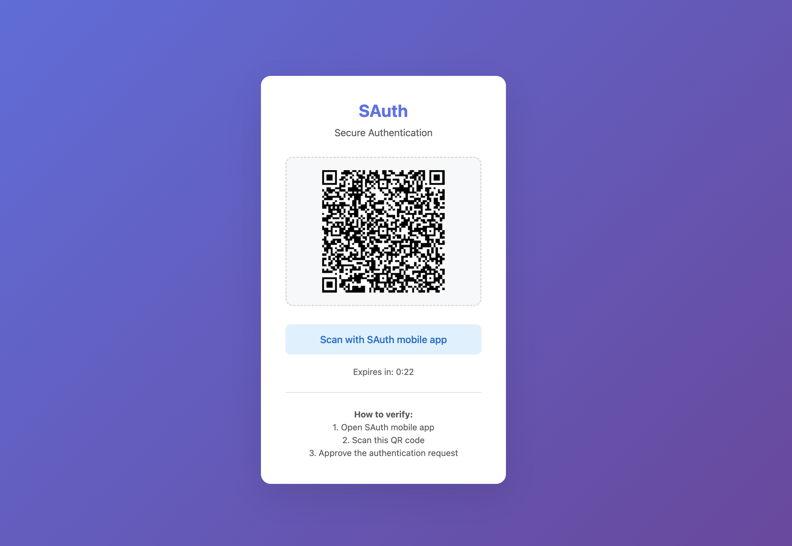

# SAuth - Secure Authentication Solution with QR Code and Mobile App

SAuth is a secure and convenient authentication solution using QR codes and a mobile app. It is designed for businesses that require strong security for transactions, logins, or any sensitive actions.

# Architecture Overview

For a detailed architecture and flow, please see [OVERVIEW.md](OVERVIEW.md).

# Demo

The following sections (1, 2, 3, 4) illustrate a demo flow of the SAuth solution, including the main tools and user experience.

## 1. Server Admin Tool

This is the backend administration tool, allowing configuration, monitoring, and management of authentication sessions.

## 2. Client Configuration

Clients can configure authentication parameters, QR code expiration time, webhook for verification results, and more.

## 3. Web Authentication Interface

When a customer needs to verify an action, they are redirected to the authentication web page, as shown below:

Here, the customer can verify transactions or log in using the SAuth solution.

## 4. QR Code Authentication Flow

After the customer continues, the system displays a QR code. This code is automatically refreshed and expires according to the client configuration.

The user opens the SAuth mobile app, scans the QR code, and completes the authentication process.

---

SAuth enhances security, reduces fraud risks, and improves user experience.
